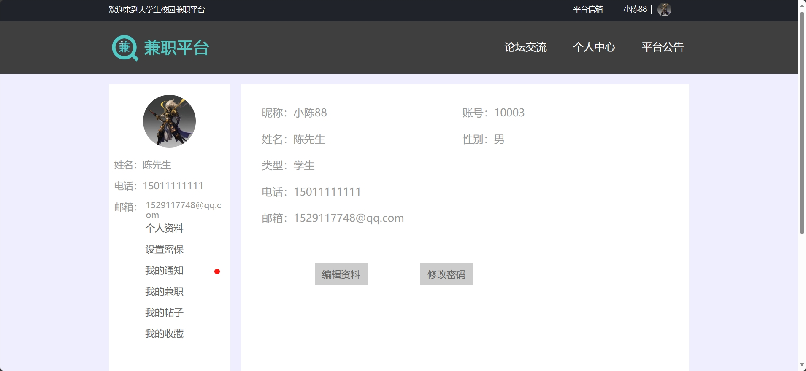

<h1 align="center">基于SSM的兼职论坛管理系统</h1>

 获取sql文件 QQ: 605739993 QQ群: 377586148 

 [个人站点: 从戎源码网](https://armycodes.com/)

## 简介

> 本代码来源于网络,仅供学习参考使用!
>
> 提供1.远程部署/2.修改代码/3.设计文档指导/4.框架代码讲解等服务
>
> 管理员地址：http://localhost:8080/moonlighting/manager/login/goServerLogin.action
> 
> 管理员: 10000 密码: 123456
>
> 用户地址：http://localhost:8080/moonlighting/pc/index/goIndex.action
> 
> 用户：10002 密码: 123456
>

## 项目介绍

基于SSM的兼职论坛管理系统：前端 JSP、LayUI、JQuery、Ajax，后端 maven、springmvc、mybatis；角色分为管理员和用户。管理员录入职位相关信息、对其中的帖子、广告、用户、公告进行管理等功能；用户按兼职类型挑选兼职、发布论坛、与客服聊天等。主要功能如下：

### 启动方式

- 前端：
> 启动Tomcat

- 后端：
> 按钮启动 | 启动Tomcat

### 管理员：

- 基本操作：登录、修改密码、获取个人信息、修改个人信息、登出
- 用户管理：添加用户、获取用户列表、查看用户详情、编辑用户信息、删除用户、筛选用户
- 兼职管理：获取兼职列表、查看兼职详情、审核兼职信息申请、编辑兼职信息、禁用兼职、筛选兼职信息
- 帖子管理：获取帖子列表、查看帖子详情、编辑帖子信息、禁用帖子、筛选帖子、查看帖子评论列表、编辑帖子评论、删除帖子评论
- 聊天管理：获取聊天信息列表、查看聊天信息详情、编辑聊天信息、删除聊天信息、筛选聊天信息
- 广告管理：获取广告列表、添加广告、编辑广告信息、删除广告信息、筛选广告信息
- 信箱管理：获取信件列表、编辑信件信息、删除信件信息、筛选信件信息
- 收藏管理：获取收藏列表、删除收藏信息、筛选收藏信息
- 轮播管理：添加轮播信息、获取轮播信息列表、编辑轮播信息、删除轮播信息、筛选轮播信息
- 公告管理：添加公告信息、获取公告信息列表、编辑公告信息、删除公告信息、筛选公告信息
- 系统设置：编辑平台信息、图片上传、删除图片

### 用户：

- 基本操作：登录、注册、忘记密码、修改密码、获取个人信息、修改个人信息、信箱发送、退出登录
- 兼职模块：获取兼职列表、筛选兼职、获取兼职详情、获取兼职发布者信息详情、与ta聊天、发布兼职、删除兼职
- 论坛模块：发布帖子、获取帖子列表、评论帖子、收藏帖子、取消收藏、查看帖子详情、删除帖子
- 公告模块：获取公告列表、查看公告详情
- 个人中心：设置密保问题、查看聊天消息、获取聊天列表、获取评论消息、回复评论、删除聊天记录、删除评论

## 环境

- <b>IntelliJ IDEA 2020.3</b>

- <b>Mysql 5.7.26</b>

- <b>Tomcat 9.0.41</b>

- <b>Maven 3.6.3</b>

- <b>JDK 1.8</b>

## 运行截图

